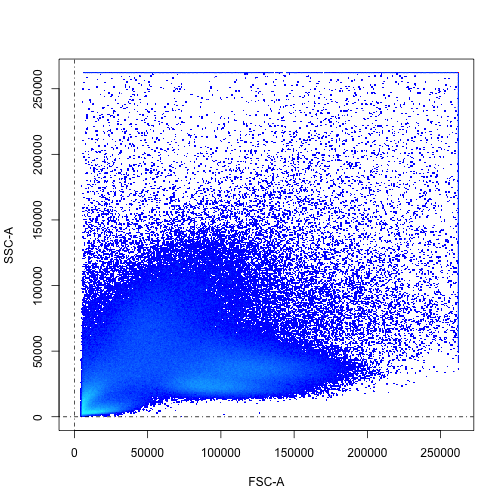
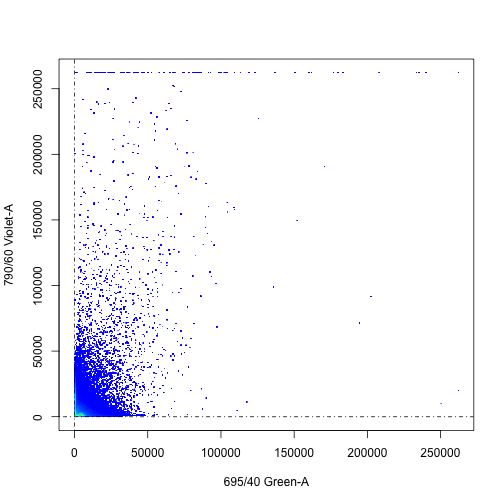
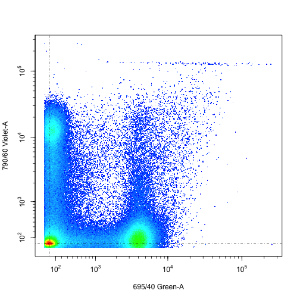
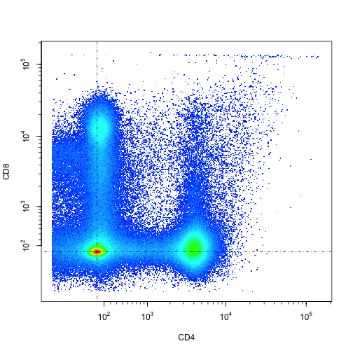
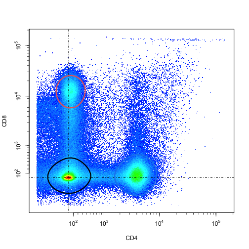
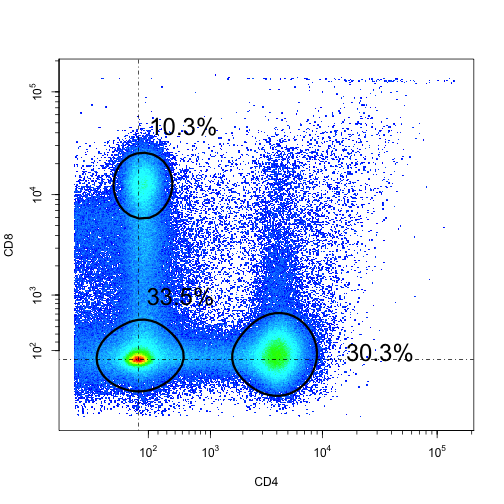
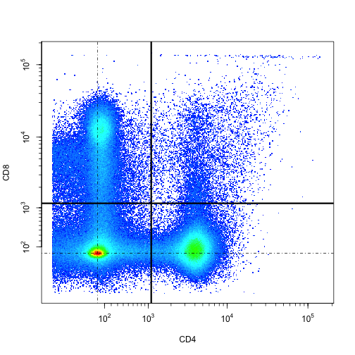
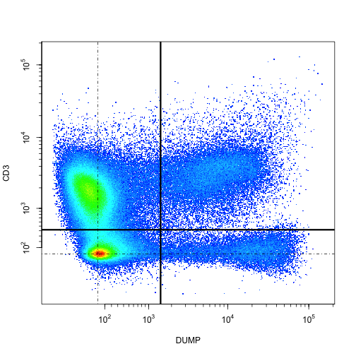
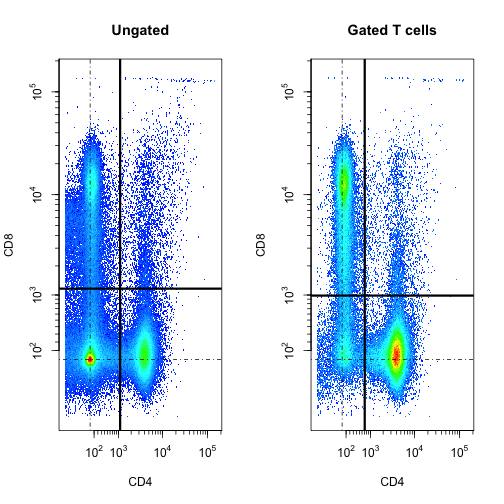

========================================================
css: rogers_rpres.css
<topic>Intro to Wade's </topic>
<topic>flow cytometry toolbox</topic>
<hr>
<lecture>2</lecture>

What is this toolbox?
========================================================

It's a loose collection of functions I've written over the years

  - Some (e.g. <b>blob.boundary, biexp</b>) perform analysis functionality
  - Some (e.g. <b>pplot, view.bivariates</b>) provide visualization methods
  - Some (e.g. <b>autocomp</b>) are methods that make flowCore functionality
  a little more convenient
  - Some (e.g. <b>bx, ibx</b>) are shorthand for functions with longer names,
    to make code easier to type and read
  - Some (e.g. <b>close.contour, kernel_function</b>) aren't meant to be called
  by the user, but exist for code modularity or reuse

It probably should be a 'utility' package, but that takes a little effort
  - you should yell at me for not doing it!

Getting a copy of the tools
========================================================

Please be sure that you have the latest toolbox snapshot:
<https://github.com/rogerswt/tools>.

If you've already cloned this project into your ~/git/R directory, that's fine!

If not, you can either
- Use git on the command line to clone the toolbox

Or
- Create an Rstudio project using the toolbox URL
- The only difference between the two methods is that the command-line way
will not result in a new 'project' in Rstudio, but the tools will still be available
to you
- Either way, make a note of the location in your filesystem of the new 'tools' directory

Set up so that tools are always in your environment
========================================================

- Go to the tools directory, and copy .Rprofile into your <b>home directory</b>
- Edit your new .Rprofile so that your FLOW_TOOLS_BASE variable points to the
location of your cloned toolbox <b>(note the trailing '/'!!!)</b>
- Quit RStudio and restart
- You should see something like this on startup:

<pre>
R version 3.4.0 (2017-04-21) -- "You Stupid Darkness"
Copyright (C) 2017 The R Foundation for Statistical Computing
Platform: x86_64-apple-darwin15.6.0 (64-bit)
...
commands executing from ~/.Rprofile
...
Source'ing Wade's flow cytometry tools
>
</pre>

Some packages you may need to get before it all works
======================================================

    ...       |    ...
--------------|-------------
    testthat  |    spam
    flowCore  |    grid
    flowViz   |    wmtsa
    splancs   |    splus2R
    sp        |    ifultools
    fields    |    MASS

Check out your environment
========================================================

- There are lots of functions
- Find pplot in the list
  - hint - the list is alphabetic
- Click on pplot and see the code in the editor

Since it's not a package, Help isn't available (bad me!)
========================================================

However, all's not lost.
- The Rstudio editor or console will help you with arguments
- Comments in the code (or the code itself) will tell you what's going on

Get some example data
========================================================

- Clone my "workshop_data" github project (<https://github.com/rogerswt/workshop_data>)
- Remember where you put it
  - a reasonable place would be "~/git/R/workshop_data"

Read in the data and examine it
========================================================

- Do this in the Console

```r
ff = read.FCS("~/git/R/workshop_data/ND 446 CMV+_unstim_004.fcs")
ff
```

```
flowFrame object '2a296bed-0c50-45ea-a91d-187d278bf92f'
with 353948 cells and 23 observables:
                name      desc  range minRange maxRange
$P1             Time      <NA> 262144     0.00   262143
$P2            FSC-A      <NA> 262144     0.00   262143
$P3            FSC-H      <NA> 262144     0.00   262143
$P4            FSC-W      <NA> 262144     0.00   262143
$P5            SSC-A      <NA> 262144   -57.12   262143
$P6            SSC-H      <NA> 262144     0.00   262143
$P7            SSC-W      <NA> 262144     0.00   262143
$P8    515/20 Blue-A  TNFalpha 262144  -111.00   262143
$P9  450/50 Violet-A  Perforin 262144  -111.00   262143
$P10 515/20 Violet-A Live/Dead 262144  -111.00   262143
$P11 585/42 Violet-A      CD57 262144  -111.00   262143
$P12 605/40 Violet-A      PD-1 262144  -111.00   262143
$P13 660/40 Violet-A     CD127 262144  -107.73   262143
$P14 710/50 Violet-A      CCR7 262144   -84.42   262143
$P15 790/60 Violet-A       CD8 262144   -86.94   262143
$P16    660/20 Red-A     Eomes 262144  -111.00   262143
$P17    713/54 Red-A  IFNgamma 262144  -109.98   262143
$P18    780/60 Red-A       CD3 262144  -111.00   262143
$P19  575/26 Green-A     T-bet 262144  -111.00   262143
$P20  610/20 Green-A    CD45RO 262144  -111.00   262143
$P21  660/20 Green-A      DUMP 262144  -111.00   262143
$P22  695/40 Green-A       CD4 262144   -75.33   262143
$P23  780/60 Green-A    CD107a 262144   -91.53   262143
311 keywords are stored in the 'description' slot
```

Make a plot
========================================================


```r
pplot(ff, c("FSC-A","SSC-A"), tx = 'linear', ty = 'linear')
```



Make another plot (CD8 vs CD4)
========================================================
incremental: true


```r
pplot(ff, c("695/40 Green-A","790/60 Violet-A"), tx = 'linear', ty = 'linear')
```



- What's wrong with this picture?
  - not compensated?
  - not transformed?

Try again
========================================================


```r
ff = autocomp(ff)
ff = doTransform(ff, cols = 8:23)
pplot(ff, c("695/40 Green-A","790/60 Violet-A"))
```



Notice
========================================================
- Omitting 'tx' and 'ty' defaults axes to biexponential
- The data seem to be properly compensated

but:
- The axis labeling is ugly.  Let's fix that...

Pretty things up
========================================================


```r
#
# Use the description field to make nice names
#
niceNames = function(ff) {
  des = parameters(ff)$desc
  idx = which(!is.na(des))

  colnames(ff)[idx] = des[idx]

  ff
}
```


```r
ff2 = niceNames(ff)
ff2
```

```
flowFrame object '2a296bed-0c50-45ea-a91d-187d278bf92f'
with 353948 cells and 23 observables:
          name      desc  range    minRange     maxRange
$P1       Time      <NA> 262144   0.0000000 2.621430e+05
$P2      FSC-A      <NA> 262144   0.0000000 2.621430e+05
$P3      FSC-H      <NA> 262144   0.0000000 2.621430e+05
$P4      FSC-W      <NA> 262144   0.0000000 2.621430e+05
$P5      SSC-A      <NA> 262144 -57.1199989 2.621430e+05
$P6      SSC-H      <NA> 262144   0.0000000 2.621430e+05
$P7      SSC-W      <NA> 262144   0.0000000 2.621430e+05
$P8   TNFalpha  TNFalpha 262144  -0.1715623 5.418538e+00
$P9   Perforin  Perforin 262144  -0.1715623 5.418538e+00
$P10 Live/Dead Live/Dead 262144  -0.1715623 5.418538e+00
$P11      CD57      CD57 262144  -0.1715623 5.418538e+00
$P12      PD-1      PD-1 262144  -0.1715623 5.418538e+00
$P13     CD127     CD127 262144  -0.1665849 5.418538e+00
$P14      CCR7      CCR7 262144  -0.1309202 5.418538e+00
$P15       CD8       CD8 262144  -0.1347903 5.418538e+00
$P16     Eomes     Eomes 262144  -0.1715623 5.418538e+00
$P17  IFNgamma  IFNgamma 262144  -0.1700105 5.418538e+00
$P18       CD3       CD3 262144  -0.1715623 5.418538e+00
$P19     T-bet     T-bet 262144  -0.1715623 5.418538e+00
$P20    CD45RO    CD45RO 262144  -0.1715623 5.418538e+00
$P21      DUMP      DUMP 262144  -0.1715623 5.418538e+00
$P22       CD4       CD4 262144  -0.1169343 5.418538e+00
$P23    CD107a    CD107a 262144  -0.1418308 5.418538e+00
311 keywords are stored in the 'description' slot
```

pplot ff2 and see what happens!
========================================================


```r
pplot(ff2, c("CD4","CD8"), xlim = c(-1, 5), ylim = c(-1, 5))
```



Let's try to identify some populations
========================================================

```r
pplot(ff2, c("CD4","CD8"), xlim = c(-1, 5), ylim = c(-1, 5))
bb_4 = blob.boundary(ff2, parameters = c("CD4", "CD8"),
                     location = bx(c(4000, 0)), height = .1)
bb_8 = blob.boundary(ff2, parameters = c("CD4", "CD8"),
                     location = bx(c(0, 20000)), height = .1)
bb_dn = blob.boundary(ff2, parameters = c("CD4", "CD8"),
                      location = bx(c(0, 0)), height = .1)
lines(bb_4, lwd = 3, col = 'dodgerblue2')
lines(bb_8, lwd = 3, col = 'indianred2')
lines(bb_dn, lwd = 3, col = 'black')
```


Notice a few things
========================================================

- The use of the function <code>bx()</code>
- the <code>height</code> parameter determines how big the contour is
  - large values of height give small contours, and vice versa
  - play around with height
- In general, it's hard to get stable and reproducible results with very small height
  - instead, we can inflate a small contour by a given distance

Put it all together
========================================================


```r
bb_4 = inflate.contour(blob = bb_4, dist = .25)
bb_8 = inflate.contour(blob = bb_8, dist = .25)
bb_dn = inflate.contour(blob = bb_dn, dist = .25)

# make gates from the polygons
gate_4 = polygonGate(.gate = bb_4)
gate_8 = polygonGate(.gate = bb_8)
gate_dn = polygonGate(.gate = bb_dn)

pplot(ff2, c("CD4","CD8"), xlim = c(-1, 5), ylim = c(-1, 5))
lines(bb_4, lwd = 3, col = 'dodgerblue2')
lines(bb_8, lwd = 3, col = 'indianred2')
lines(bb_dn, lwd = 3, col = 'black')
```



And count some populations
========================================================

add some numbers



Here's the code for that last picture
========================================================


```r
n_cd4 = nrow(Subset(ff2, gate_4))
n_cd8 = nrow(Subset(ff2, gate_8))
n_dn = nrow(Subset(ff2, gate_dn))
pplot(ff2, c("CD4","CD8"), xlim = c(-1, 5), ylim = c(-1, 5))
lines(bb_4, lwd = 3)
lines(bb_8, lwd = 3)
lines(bb_dn, lwd = 3)
n_tot = nrow(ff2)
text(x = mean(bb_4[, 1]) + 1, y = mean(bb_4[, 2]),
     labels = sprintf("%.1f%%", 100 * n_cd4 / n_tot), pos = 4, cex = 2)
text(x = mean(bb_8[, 1]), y = mean(bb_8[, 2]) + 1,
     labels = sprintf("%.1f%%", 100 * n_cd8 / n_tot), pos = 4, cex = 2)
text(x = mean(bb_dn[, 1]), y = mean(bb_dn[, 2]) + 1,
     labels = sprintf("%.1f%%", 100 * n_dn / n_tot), pos = 4, cex = 2)
```

If blobs aren't the right tool, we could try quadrants
========================================================


```r
thresh_cd4 = ibx(deGate(ff2,channel = "CD4"))
thresh_cd8 = ibx(deGate(ff2,channel = "CD8"))
pplot(ff2, c("CD4", "CD8"), xlim = c(-1, 5), ylim = c(-1, 5))
xline(bx(thresh_cd4), lwd = 3)
yline(bx(thresh_cd8), lwd = 3)
```



```r
qg = quadGate(filterId="quad", "CD4" = bx(thresh_cd4), "CD8" = bx(thresh_cd8))
sapply(split(ff2, qg), FUN = function(x){nrow(x)}) / n_tot
```

```
  CD4+CD8+   CD4-CD8+   CD4+CD8-   CD4-CD8- 
0.01874287 0.20987546 0.32718648 0.44419519 
```

Of course, we should have gated on CD3+ and DUMP- in the first place
========================================================


```r
pplot(ff2, c("DUMP", "CD3"), xlim = c(-1, 5), ylim = c(-1, 5))
thresh_cd3 = ibx(deGate(f = ff2, channel = "CD3"))
thresh_dump = ibx(deGate(f = ff2, channel = "DUMP"))
xline(bx(thresh_dump), lwd = 3)
yline(bx(thresh_cd3), lwd = 3)
```



```r
qg_tcell = quadGate(filterId="tcell", "DUMP" = bx(thresh_dump), "CD3" = bx(thresh_cd3))
tcell = split(ff2, qg_tcell)$`DUMP-CD3+`
n_tcell = nrow(tcell)
```

Gating on T cells gives saner results
========================================================


```r
par(mfrow = c(1, 2))
pplot(ff2, c("CD4", "CD8"), xlim = c(-1, 5), ylim = c(-1, 5), main = "Ungated")
xline(bx(thresh_cd4), lwd = 3)
yline(bx(thresh_cd8), lwd = 3)

thresh_cd4 = ibx(deGate(tcell,channel = "CD4"))
thresh_cd8 = ibx(deGate(tcell,channel = "CD8"))
pplot(tcell, c("CD4", "CD8"), xlim = c(-1, 5), ylim = c(-1, 5), main = "Gated T cells")
xline(bx(thresh_cd4), lwd = 3)
yline(bx(thresh_cd8), lwd = 3)
```


And the numbers
========================================================


```r
qg2 = quadGate(filterId="quad", "CD4" = bx(thresh_cd4), "CD8" = bx(thresh_cd8))
sapply(split(ff2, qg), FUN = function(x){nrow(x)}) / n_tot
```

```
  CD4+CD8+   CD4-CD8+   CD4+CD8-   CD4-CD8- 
0.01874287 0.20987546 0.32718648 0.44419519 
```

```r
sapply(split(tcell, qg2), FUN = function(x){nrow(x)}) / n_tcell
```

```
  CD4+CD8+   CD4-CD8+   CD4+CD8-   CD4-CD8- 
0.02766564 0.28483498 0.56644538 0.12105400 
```

What's next?
========================================================

Up to now, we've only been talking about how to automate the same kind of sequential
gating analysis you might do manually in Flowjo
- But it's even more cumbersome than Flowjo, so why bother???
    - <b>Reason #1:</b> You can do it on 100's, 1000's, ... of samples
    - <b>Reason #2:</b> You can repeat it exactly (or tell someone else how) = reproducible research
    - <b>Reason #3:</b> It can be the precursor to downstream gate-less analyses
        - Gating for cleanup (singlets, live cells, etc)
        - Datamining on only the good stuff

In upcoming sessions we'll talk about some of these strategies


